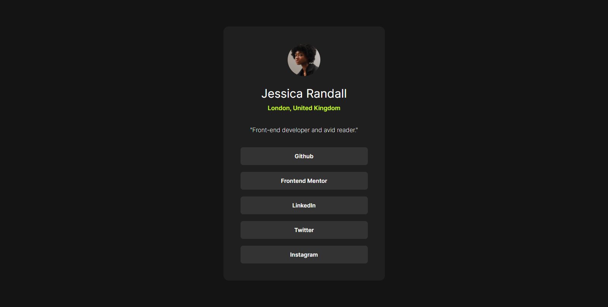

# Frontend Mentor - Social links profile solution

This is a solution to the [Social links profile challenge on Frontend Mentor](https://www.frontendmentor.io/challenges/social-links-profile-UG32l9m6dQ). Frontend Mentor challenges help you improve your coding skills by building realistic projects.

### Table of contents

- [Overview](#overview)
  - [The challenge](#the-challenge)
  - [Screenshot](#screenshot)
  - [Links](#links)
- [Built with](#built-with)
- [Author](#author)

### Overview

#### The challenge

Users should be able to:

- See hover and focus states for all interactive elements on the page

#### Screenshot

#### Links

- Solution URL: [Solution URL]()
- Live Site URL: [Live Site URL](https://sam4web.github.io/social-links-profile/)

### Built with

- Semantic HTML5 markup
- CSS
- Flexbox

### Author

- Sijal Manandhar
- Github - [sam4web](https://github.com/sam4web/)
- Frontend Mentor - [@sam4web](https://www.frontendmentor.io/profile/sam4web)
